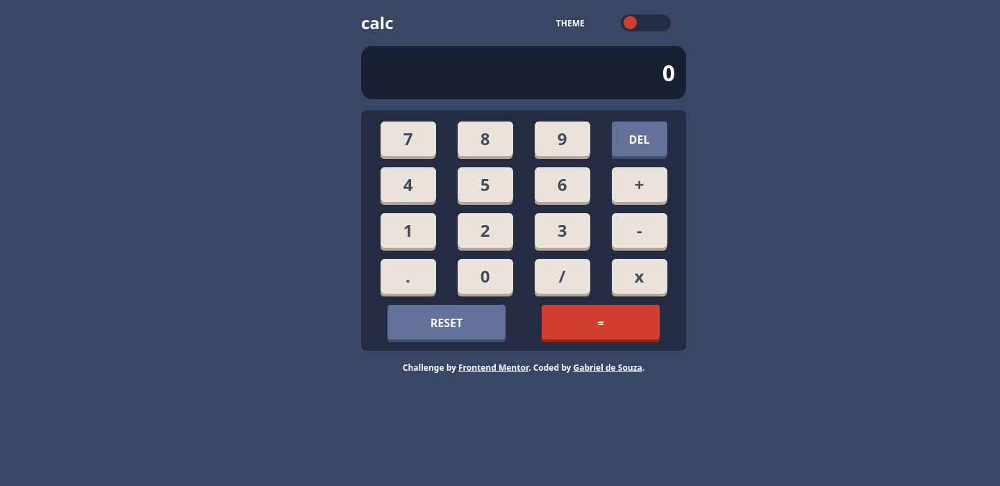
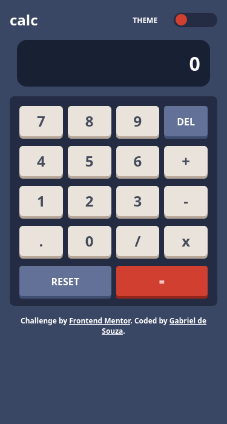

# Frontend Mentor - Calculator app solution

This is my solution to the [Calculator app challenge on Frontend Mentor](https://www.frontendmentor.io/challenges/calculator-app-9lteq5N29). Thank you Frontend Mentor for the opportunity to cultivate my skill.

## Table of contents

-  [Overview](#overview)
   -  [The challenge](#the-challenge)
   -  [Screenshots](#screenshots)
   -  [Links](#links)
-  [My process](#my-process)
   -  [What I'm proud of](#what-im-proud-of)
   -  [What I would do differently](#what-i-would-do-differently)
   -  [What challenges I faced](#what-challenges-i-faced)
-  [Author](#author)

## Overview

### Screenshots

### Links

-  Solution URL: [Github repository](https://github.com/gab-souza-martins/app-calculator)
-  Live Site URL: [Github pages](https://gab-souza-martins.github.io/app-calculator/)

## My process

### What I'm proud of

I am proud of having done my first project with TypeScript. It was less familiar than regular JavaScript, but I can see how it will improve my code long-term. I am also happy to have completed the HTML and CSS parts rather quickly, which shows great progress since I have started.

### What I would do differently

I am aware using "eval()" for the calculation isn't the best solution, though it was the most convinient for my level, specially since this isn't a professional project, in the sense I am not doing this officially for any company.

### What challenges I faced

I had some difficulty with the TS code, though I eventually pulled through. The toggle switch only worked once per page refresh, until I tried updating it every time the theme was switched. I also had to look through quite a few Stack Overflow threads to find the solution for the calculation, which I had first assumed would've been easier.

I also had difficulty with the width of the calculator's display. For some reason, it kept leaving the parent's area, and I had to make a poor solution by limiting its size, making it slightly shorter than the rest of the app. I would love to find out the cause of this and how to fix it.

## Author

-  Github - [Gabriel de Souza](https://github.com/gab-souza-martins)
-  Frontend Mentor - [Gabriel de Souza](https://www.frontendmentor.io/profile/gab-souza-martins)
